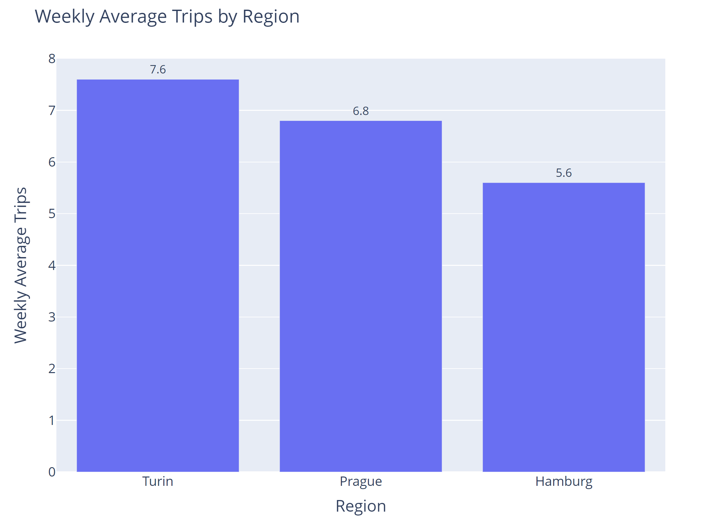

# jobsity-challenge
### Data Engineering Challenge

jobsity-challenge app is a command line tool build in Python that take the CSV file with trips taken by different vehicles and calculate the weekly average by Region.

Output:
- Calculate the weekly average number of trips by region. 
- The app will create a chart with the data.

Requirements:
- A SQL sever Management Studio database (can be local).
- Database connection uses Windows Authentication.
- Python 3 installed in your machine.
- Check requirements.txt for Python packages.
        
In order to run the app you will need to follow next steps:
1. Install SQL Server Management Studio (The app can handle other connections using the config.json)
2. Install Python 3 and packages in requirements.txt
3. Download Git repository keeping the same structure
4. Complete the config.json file with your setup 
5. Load the csv file in the input folder. The expected schema is (region, origin_coord, destination_coord, datetime, datasource)  
6. Create the Database and the connection using command create_database
7. Load file with load_file given in the input folder in the json file 
8. Calculate the weekly average using weekly_average 
            
To check the status of the file loaded in the DB use file_status command. 

Use the command --help for more information.

### Output Example

The app will output a barchart showing the weekly average by Region

### Areas of improvement 
- Use an open source SQL database such as SQLite where we can share the DB as a file
- Use partitions and indexes in SQL tables
- Include a table with values in the output plot