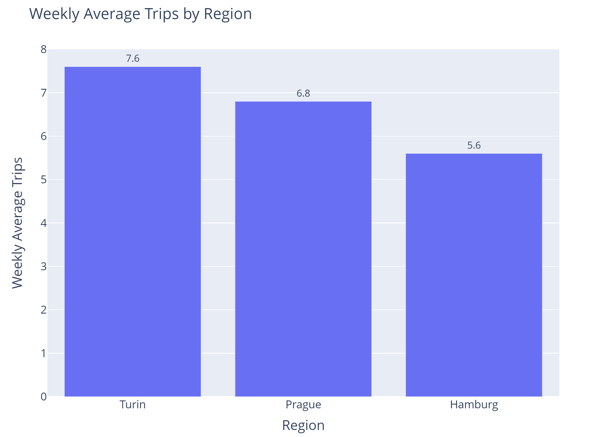

# Running the jobsity-app

Start with the --help command for an initial approach of the app
```
    py jobsity_app.py --help
```
As result we have a short descriptions, step-by-step to run the app and all the commands available


Run create_dtabase to start the SQL Alchemy engine and create database, schemas and tables
```
    py jobsity_app.py create_database
```


Run load_file to populate staging table with raw data from the csv and the aggregated table with the trips grouping and columns formatting
```
    py jobsity_app.py create_database
```


Run weekly_average to first generate the query needed to build the barchart with the weekly average trips by region
```
    py jobsity_app.py weekly_average
```



table_status command will generate a report with the latest batch uploaded to each table. 

