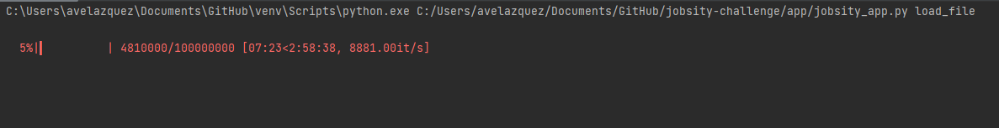
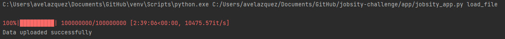

### Stress the app with 100M records 

In order to test the app with multiple records several actions were taken:

1. CSV file is processed in chunks using pandas. While pandas library loads all the information in memory we use the chunks method to split the file in smaller parts. Another alternative could be using dask library.
2. We use the faker library to generate bigger files with 1M, 10M and 100M of records. It took around 3 hours to generate the biggest file. Even though columns don't have the same data, it is still useful to test the app.
3. Even though SQL Server could handle the file without problems it is possible to generate partitions to improve readability. 
4. A progress bar was used to show the status of the loading process

Script of the data generator is located in data/data_generator folder.

